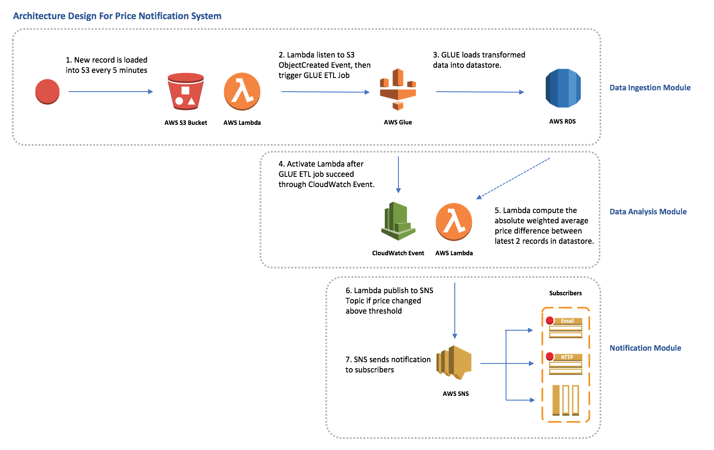

# Price Notification System

## Data Analysis Module Deployment
```bash
# set up aws cli credential
$ aws configure

# change to terraform directory
$ cd terraform/

# confirm resource deploy
$ terraform apply

# ...

Do you want to perform these actions?
  Terraform will perform the actions described above.
  Only 'yes' will be accepted to approve.

  Enter a value:

# enter 'yes' to depoy
```

## Time Allocation
1. Research:  2 hours - comparing between kinesis, athena and glue, terraform and cloudformation tutorial, lambda publish to SNS topic.  
2. Learning:  4 hours - learning glue, athena, terraform/cloudformation
3. Design: 1 hour  
4. Implementation: 4 hours - stuck at athena, revert back to using lambda in data analysis module implementation  
5. Documentation: 1 hour  

----
## AWS Architecture Design Diagram


#### Architecture Design Description
1. Source data of latest ETH price is loaded into S3 Bucket every 5 minutes. The data consist of 1 price record and can be in any format (xml, json, text, etc)
2. AWS Lambda listen to the `s3:ObjectCreated` event for the bucket with prefix of `/crypto/01-data-ingestion`, and trigger AWS Glue to run ETL job on the data. Glue crawler can be used when the data format has changed to map to the desired schema.
3. Set AWS Glue output format to be csv, and load the output file to S3 bucket at sub folder `/crypto/02-data-analysis`.
4. AWS Lambda listen to the `s3:ObjectCreated` event for the bucket with prefix of `/crypto/02-data-analysis`, and trigger a lambda function to calculate the absolute price change percentage of the latest `weightedAverage` with the previous `weightedAverage`.
5. AWS Lambda publish to SNS topic if the percentage price changed is above the threshold.
6. AWS SNS send out notification to the subscribers.

----
## Design Assumptions
1. The data source is store in s3 bucket at sub folder `/crypto/01-data-ingestion`.
2. Every 5 minutes there will be an s3 object created in sub folder `/crypto/01-data-ingestion` with 1 price record.
3. The data ingestion module will transform the individual price records in `/crypto/01-data-ingestion` to csv file and load to the s3 bucket at sub folder `/crypto/02-data-analysis`.

----
## Constraints of Design
#### Data Ingestion Module
1. Limited to ingesting data from S3 bucket, this design did not account for data coming from api endpoints through http request.
2. The output data is in S3 bucket instead of database, might reduce the flexibility of connecting to third party app compare to using database connection string.

#### Data Analysis Module
1. Using lambda for analysis is not very efficient compare to Athena or EMR when the data set is very large.

#### Notification Module
1. Might need further configuration when using slack as subscribers to AWS SNS.

----
## Improvements
1. Use Athena instead of lambda to analyse price change percentage.
2. Use S3 Lifecycle to remove old data files in sub folder `/crypto/01-data-ingestion` which are already ingested to datastore.
3. Glue output as parquet and use month to partition for complex and large data set analysis using Athena.

----
## Tradeoffs of Design
#### Data Ingestion Module
1. Use Glue to cater for different kind of data input (xml, json, text, etc) instead of Athena which can directly query from source data if the input format is standardise.
2. Selecting Terraform instead of Cloudformation as Terraform is platform agnostic and easier learning curve.
